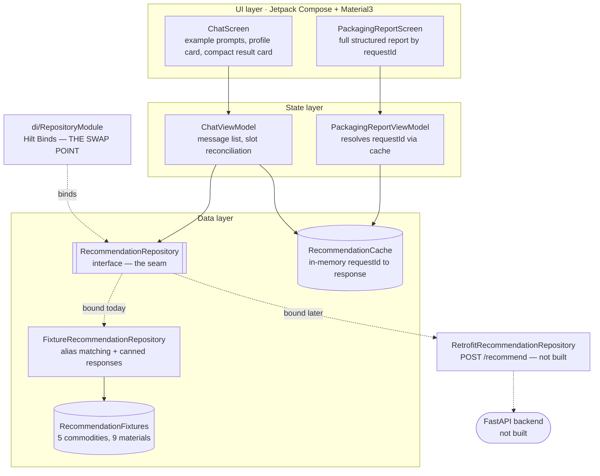
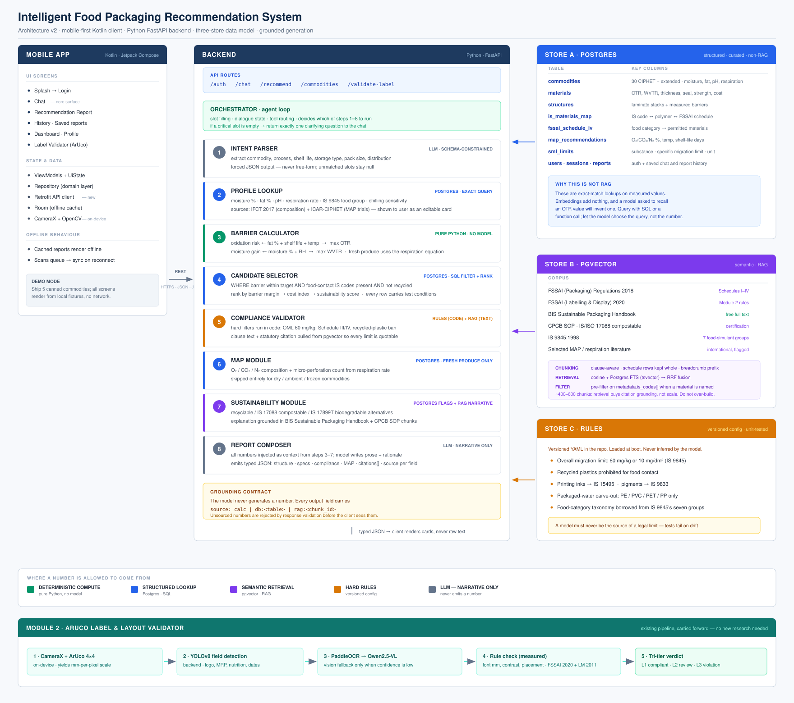
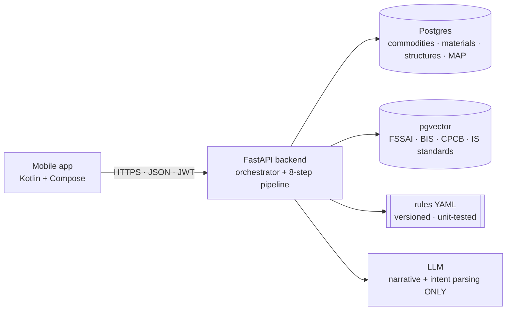

# SIH26034 — Intelligent Food Packaging Recommendation System

An AI decision-support tool that tells a food processor **which packaging
material and specification to use** for a given commodity — and shows the
regulation, standard or calculation every number came from.

Built for Smart India Hackathon 2026 (SIH). Mobile-first: Android (Kotlin +
Jetpack Compose) today, Python/FastAPI backend next.

> **Status: working offline demo skeleton.** The mobile app runs the full
> chat → recommendation → report flow against curated fixtures. The demo now
> includes a shelf-life/storage scenario matrix, editable profile card,
> follow-up answer bank, comparison view and guided peanut walkthrough. The
> backend, curated materials dataset and RAG corpus do not exist yet. The pure
> Kotlin domain/fixture/chat logic compiles with Kotlin/JVM and the barrier
> scenario smoke check passes; the full Android Gradle build remains pending
> because this sandbox cannot download Gradle 8.13 over TLS — see
> [Verification status](#10-verification-status).

---

## Contents

1. [The idea](#1-the-idea)
2. [Problem statement](#2-problem-statement)
3. [The solution](#3-the-solution)
4. [Architecture](#4-architecture)
5. [Response contract](#5-response-contract)
6. [Technology stack](#6-technology-stack)
7. [Repository layout](#7-repository-layout)
8. [Getting started](#8-getting-started)
9. [Data sources and data honesty](#9-data-sources-and-data-honesty)
10. [Verification status](#10-verification-status)
11. [Roadmap](#11-roadmap)
12. [Appendix — Module 2: Legal Metrology inspection](#appendix--module-2-legal-metrology-inspection)

---

## 1. The idea

A small manufacturer in India knows what they are selling — ground chilli, milk
powder, fresh okra — and how long it needs to last. They do **not** know their
product's water activity, the oxygen transmission rate their film needs, or which
clause of the FSSAI Packaging Regulations applies to a metalized laminate. That
knowledge sits in standards documents, supplier datasheets and the heads of
packaging engineers, and it is the reason good products fail in transit.

This system closes that gap. You describe what you are packing in plain language
— *"how should I package roasted peanuts for 6 months?"* — and get back a
structured recommendation: the laminate, the barrier window it must hit, the film
thickness, whether it needs modified atmosphere, whether it is legal for food
contact, what a cheaper or more sustainable alternative would cost you, and the
citation for every claim.

Two design commitments make this more than a chatbot wrapped around a datasheet:

- **The model never invents a number.** Every figure is calculated, looked up,
  or retrieved — and tagged with where it came from. This is enforced by the
  type system, not by a prompt asking nicely.
- **You do not have to know your own product's chemistry.** The system infers
  moisture, fat, pH and respiration rate from published Indian food composition
  data, shows you the inferred profile as an editable card, and lets you correct
  any value you happen to know better.

### Two modules

| Module | What it is | Status |
|---|---|---|
| **Module 1 — Packaging Advisor** | The RAG-driven consultant described above. | **Primary system.** Skeleton built, runs offline on fixtures. |
| **Module 2 — ArUco label & layout validator** | The original scanning pipeline (CameraX + ArUco → YOLOv8 → PaddleOCR / Qwen2.5-VL), repurposed to validate the label a pack *already has* and return an L1/L2/L3 verdict. | **Side feature.** Pre-existing code, carried forward. See [§4.4](#44-module-2--aruco-label--layout-validator). |

## 2. Problem statement

**As issued:** build AI-powered intelligent packaging recommendation software for
the food processing and packaging industry.

**Inputs the system accepts**

| Input | Notes |
|---|---|
| Commodity type | Scoped to the ~30 commodities ICAR-CIPHET has published data for |
| Moisture content | Inferred from IFCT 2017 when unknown; user-correctable |
| Oil / fat content | Drives oxidation risk → O₂ barrier |
| pH | Drives migration sensitivity; food-simulant group per IS 9845 |
| Respiration rate | mg CO₂/kg/h — fresh produce only |
| Desired shelf life | Days or months; typed in natural language |
| Storage temperature | °C |
| Relative humidity | % RH |
| Transportation conditions | Ambient distribution, cold chain, frozen |
| Storage type | Ambient / chilled / frozen |

**Outputs the system produces**

- **Material recommendation** from LDPE, HDPE, PET, metalized films, aluminium
  foil laminates, biodegradable films and breathable films.
- **Specification:** OTR, WVTR, film thickness, sealability, gas permeability,
  mechanical strength, MAP suitability.
- **For fresh produce:** respiration rate drives breathable / micro-perforated
  film selection plus a target gas composition (O₂ / CO₂ / N₂).
- **Compliance notes** against FSSAI (Packaging) Regulations 2018 with citations.
- **Sustainable and cheaper alternatives**, each with its trade-off stated.
- Roadmap: shelf-life prediction, sustainability scoring, cost optimization, QR
  traceability.

**Audience:** food processing industries, farmers and FPOs, startups, and
researchers.

## 3. The solution

### 3.1 Grounding contract — the rule everything else follows

> **The LLM never generates a number.**

Every claim group in a response carries a `SourceRef` with
`kind ∈ { CALC, DB, RAG, USER }`:

| Kind | Meaning | Example |
|---|---|---|
| `CALC` | Deterministic arithmetic in pure Python, no model involved | `barrier.oxidative` |
| `DB` | Exact-match lookup against a curated Postgres table | `ifct2017`, `ciphet-map` |
| `RAG` | Text retrieved from the regulatory corpus in pgvector | `fssai-pkg-2018` |
| `USER` | Supplied or corrected by the user | — |

Response validation rejects any unsourced numeric claim **before the client sees
it**. The model writes narrative and rationale; it never originates a figure.
This is why the contract is a `SourceRef` field on the data classes themselves
(`domain/model/Recommendation.kt`) rather than a convention.

### 3.2 What makes the answers trustworthy

- **Barrier targets are computed, not recalled.** Step 3 of the pipeline is pure
  Python. An LLM asked for the OTR of a 12 µ PET film will produce a plausible
  number that is wrong; a SQL query against a curated table will not.
- **Every barrier figure carries its test conditions.** OTR and WVTR are
  meaningless without temperature, RH and thickness, so `BarrierSpec` and
  `PackagingMaterial` both carry `(value, unit, temp_C, rh_pct)` — and materials
  additionally carry thickness and the layer stack.
- **Fresh produce gets a window, not a ceiling.** A film that is too tight drives
  respiring produce anaerobic just as fast as one that is too loose lets it
  spoil. `BarrierSpec` therefore carries optional **minimums** as well as
  maximums.
- **Legal limits are configuration, not inference.** Overall migration limits,
  the recycled-plastics prohibition and the ink/pigment standards live in
  versioned YAML with unit tests. A model must never be the source of a legal
  limit.
- **Every limit is quotable.** Compliance notes arrive with the clause and
  citation attached, so a recommendation can be defended to an auditor.

### 3.3 What the user experiences

```
Splash → Login → Chat (3–5 tappable example prompts, never a blank box)
                  ↓  conversational intake, at most one clarifying question
             Profile card (auto-inferred, tap any value to correct)
                  ↓
             Recommendation Report
               · Recommended structure + why
               · Target barrier window
               · MAP gas mix (fresh produce only)
               · Compliance notes + citations
               · Cheaper / greener / higher-barrier alternatives
                  ↓
             Follow-up chat in context ("why not plain LDPE?",
             "cheapest option that still hits 6 months?")
                  ↓
             Saved reports · History · Module 2 scanner
```

## 4. Architecture

### 4.1 As implemented today

The whole system currently lives inside the Android app and runs with **no
network at all**. This is deliberate: the contract was fixed first, so the UI
could be built and reviewed before any of the hard parts existed.



File by file:

| Piece | File | State |
|---|---|---|
| Response contract | `domain/model/Recommendation.kt` | Done — pure Kotlin, mirrors the JSON the backend will emit |
| Repository seam | `domain/repository/RecommendationRepository.kt` | Done — 3 methods |
| Fixture implementation | `data/repository/FixtureRecommendationRepository.kt` | Done — keyword/alias matching |
| Demo data | `data/fixtures/RecommendationFixtures.kt` | Done — 5 commodities, 9 materials |
| DI binding | `di/RepositoryModule.kt` | Done — **the single swap point** |
| Session handoff | `data/repository/RecommendationCache.kt` | Done, in-memory — Room is a TODO |
| Chat UI | `ui/screens/chat/{ChatScreen, ChatViewModel, ChatComponents}.kt` | Done |
| Report UI | `ui/screens/report/{PackagingReportScreen, PackagingReportViewModel}.kt` | Done |
| Navigation | `ui/navigation/{Screen, AppNavGraph}.kt` | Done — Chat is the post-login start destination |
| FastAPI backend | — | Not started |
| Curated materials DB | — | Not started |
| pgvector corpus | — | Not started |

**Swapping fixtures for the network is a one-file change.** Every screen and
ViewModel is written against `RecommendationRepository`; write a Retrofit
implementation, rebind it in `di/RepositoryModule.kt`, and nothing above the
interface moves.

### 4.2 Target architecture — backend online



Full size: [`architecture-v2.svg`](docs/architecture-v2.svg) ·
[`architecture-v2.png`](docs/architecture-v2.png) (for viewers that don't render
SVG) · the narrative version of the same design:
[`docs/PACKAGING_ADVISOR.md`](docs/PACKAGING_ADVISOR.md).

At a glance:



An orchestrator (an agent loop) does slot filling and tool routing. If a critical
slot is empty it returns **exactly one** clarifying question to the chat rather
than guessing.

| Step | Module | What it does | Number source |
|---|---|---|---|
| 1 | Intent parser | LLM, schema-constrained JSON — never free-form; unmatched slots stay `null` | — |
| 2 | Profile lookup | Postgres: moisture, fat, pH, respiration, food group, chilling sensitivity | `DB` |
| 3 | Barrier calculator | **Pure Python, no model.** Oxidation risk → max OTR; moisture gain → max WVTR; respiration equation for fresh produce | `CALC` |
| 4 | Candidate selector | SQL filter + rank by barrier margin → cost → sustainability; every row carries test conditions | `DB` |
| 5 | Compliance validator | Hard filters in **code** (OML 60 mg/kg, Schedules III/IV, recycled-plastic ban); clause text + citation from pgvector | `RAG` + rules |
| 6 | MAP module | O₂/CO₂/N₂ %, micro-perforation count — fresh produce only, skipped otherwise | `DB` + `CALC` |
| 7 | Sustainability module | Recyclable / IS 17088 compostable alternatives, explained from BIS + CPCB chunks | `DB` + `RAG` |
| 8 | Report composer | LLM, **narrative only**; all numbers injected as context from steps 3–7 | — |

### 4.3 Three data stores, and why RAG is only one of them

The central design decision is that **not everything should be RAGged**.

| Store | Technology | Holds | Why this store |
|---|---|---|---|
| **A — Structured** | PostgreSQL | `commodities` (CIPHET's ~30 + extended) · `materials` (OTR, WVTR, thickness, seal, strength, cost) · `structures` (laminate stacks + measured barriers) · `is_materials_map` (IS code ↔ polymer ↔ FSSAI schedule) · `fssai_schedule_iv` (food category → permitted materials) · `map_recommendations` (O₂/CO₂/N₂ %, temp, shelf life) · `sml_limits` · `users` · `sessions` · `reports` | Exact-match lookups on **measured** values. Embeddings add nothing, and a model asked to recall an OTR will invent one. |
| **B — Semantic** | PostgreSQL + pgvector | FSSAI (Packaging) Regulations 2018 · FSSAI (Labelling & Display) 2020 · BIS Sustainable Packaging Handbook · CPCB SOP / IS-ISO 17088 · IS 9845:1998 · selected MAP and respiration literature (flagged international, not Indian regulation) | Retrieval buys **citation grounding**, not scale. ~400–600 chunks, clause-aware, schedule rows kept whole, cosine + `tsvector` FTS fused with RRF. No reranker — deliberately. |
| **C — Rules** | Versioned YAML in-repo, loaded at boot | OML 60 mg/kg or 10 mg/dm² (IS 9845) · recycled plastics prohibited · inks → IS 15495 · pigments → IS 9833 · packaged-water carve-out · food-category taxonomy | A model must never be the source of a legal limit. Limits are data a human reviews and code enforces. |

### 4.4 Module 2 — ArUco label & layout validator

The original pipeline, carried forward as a side feature. It answers a different
question: *does the label already on this pack comply?*

1. **CameraX + ArUco 4×4** — on-device, yields an exact mm-per-pixel scale.
2. **YOLOv8 field detection** — logo, MRP, nutrition panel, dates.
3. **PaddleOCR → Qwen2.5-VL** — the vision model is a fallback, only when OCR
   confidence is low.
4. **Rule check on measured values** — font size in mm, contrast, placement,
   against FSSAI 2020 and Legal Metrology 2011.
5. **Tri-tier verdict** — L1 compliant · L2 needs review · L3 violation.

## 5. Response contract

`RecommendationResponse` is the whole payload — one instance renders the report
screen, and the chat shows a condensed card built from the same object.

```
RecommendationResponse
├── requestId        String
├── commodity        CommodityProfile    ← auto-inferred, user-correctable
├── assumptions      List<String>        ← what the engine assumed for blank slots
├── recommended      PackagingMaterial   ← structure, OTR, WVTR, thickness, seal,
│                                          tensile, recyclable, compostable,
│                                          IS codes, cost index, provenance
├── barriers         BarrierSpec         ← target window, incl. optional MINIMUMS
├── map              MapRecommendation?  ← O₂/CO₂/N₂ %, temp, perforation
├── compliance       List<ComplianceNote>
├── alternatives     List<Alternative>   ← CHEAPER / SUSTAINABLE / HIGHER_BARRIER
├── citations        List<Citation>
├── narrative        String              ← model prose, refers only to numbers
│                                          already present elsewhere in the object
└── followUps        List<String>        ← quick-reply chips
```

## 6. Technology stack

### Mobile — shipped in `mobile-app/`

| Layer | Technology | Version |
|---|---|---|
| Language | Kotlin | 2.1.0 |
| Build | Gradle (wrapper) · Android Gradle Plugin · KSP · Gradle version catalog | 8.13 · 8.13.2 · 2.1.0-1.0.29 |
| SDK | `compileSdk` / `targetSdk` / `minSdk` · Java & JVM target | 35 / 35 / 26 · 17 |
| UI | Jetpack Compose BOM · Material3 · Material Icons Extended · Activity Compose · Splash Screen | 2024.12.01 · 1.9.3 · 1.0.1 |
| Navigation | Navigation Compose | 2.8.5 |
| DI | Hilt · Hilt Navigation Compose · Hilt Work | 2.54 · 1.2.0 · 1.2.0 |
| Async | Kotlin Coroutines · Lifecycle Runtime / ViewModel Compose | 1.9.0 · 2.8.7 |
| Persistence | Room · DataStore Preferences · WorkManager | 2.6.1 · 1.1.2 · 2.10.0 |
| Networking | Retrofit · OkHttp (+ logging interceptor) · kotlinx-serialization JSON · Retrofit kotlinx-serialization converter | 2.11.0 · 4.12.0 · 1.7.3 · 1.0.0 |
| Camera & vision | CameraX · OpenCV (`org.opencv:opencv`, Maven Central) · ML Kit Barcode Scanning | 1.3.1 · 4.9.0 · 17.3.0 |
| Media | Lottie Compose · Coil | 6.6.2 · 2.7.0 |
| PDF | iText 7 Community | 7.2.5 |
| Permissions | Accompanist Permissions | 0.37.0 |
| UI (legacy views) | Android Material Components | 1.12.0 |

Retrofit, OkHttp and kotlinx-serialization are declared but not yet used — no
networking code exists until the backend lands.

### Module 2 — vision stack

| Component | Role |
|---|---|
| ArUco 4×4 markers (OpenCV) | Deterministic mm-per-pixel scale reference |
| YOLOv8 | Label-field detection (logo, MRP, nutrition panel, dates) |
| PaddleOCR | Primary text extraction |
| Qwen2.5-VL | Vision-language fallback at low OCR confidence |

### Backend — planned, not built

| Layer | Technology |
|---|---|
| Language & framework | Python 3.12 · FastAPI · Uvicorn |
| Validation | Pydantic v2 (the response schema is the contract) |
| ORM & migrations | SQLAlchemy 2 · Alembic |
| Database | PostgreSQL 16 + pgvector |
| Retrieval | pgvector cosine + PostgreSQL `tsvector` FTS, fused with RRF |
| Embeddings | A sentence-transformers/BGE-class model — exact model undecided |
| Rules | PyYAML, versioned in-repo, unit-tested |
| LLM | **Provider-agnostic interface, stubbed.** The provider is chosen later and never leaks to the client |
| Ops | Docker Compose · pytest |

### Data and standards corpus

| Source | Used for |
|---|---|
| IFCT 2017 (ICMR–NIN) | Commodity composition: moisture, fat, pH |
| ICAR-CIPHET MAP protocols | Fresh-produce respiration and shelf-life trial data |
| FSSAI (Packaging) Regulations 2018 | Schedules I–IV, migration limits, permitted materials |
| FSSAI (Labelling & Display) Regulations 2020 | Module 2 label rules |
| BIS Sustainable Packaging Handbook | Sustainability narrative |
| CPCB SOP · IS/ISO 17088 | Compostability criteria |
| IS 9845:1998 | Overall migration, seven food-simulant groups |
| IS 15495 · IS 9833 | Printing inks · pigments and colourants |
| Legal Metrology (Packaged Commodities) Rules 2011 | Module 2 declarations and font sizes |

## 7. Repository layout

```
.
├── README.md                      ← this file
├── docs/
│   ├── PACKAGING_ADVISOR.md       ← Module 1 design in full
│   ├── architecture-v2.svg        ← target architecture diagram
│   ├── architecture-v2.png        ← PNG export of the same diagram
│   ├── architecture-diagram.svg   ← original (Module 2) diagram
│   ├── ARUCO_MARKER_GENERATION.md
│   └── legal-metrology-packaged-commodities-rules-2011.pdf
├── mobile-app/
│   ├── gradlew · gradlew.bat · gradle/wrapper/   ← added so a clone can build
│   └── app/src/main/java/com/legalmetrology/inspector/
│       ├── ar/                    ← ARCore + CameraX capture (Module 2)
│       ├── data/
│       │   ├── api/               ← DTOs + mock service (Module 2)
│       │   ├── db/                ← Room database, DAO, entities
│       │   ├── fixtures/          ← RecommendationFixtures (Module 1 demo data)
│       │   └── repository/        ← FixtureRecommendationRepository + cache
│       ├── domain/
│       │   ├── model/             ← Recommendation.kt (Module 1 contract) + Models.kt
│       │   └── repository/        ← RecommendationRepository (the seam)
│       ├── di/                    ← Hilt modules; RepositoryModule = swap point
│       └── ui/
│           ├── navigation/        ← NavGraph + Screen routes
│           ├── screens/           ← splash · login · chat · report · scan ·
│           │                        review · history · dashboard · ecommerce
│           └── theme/
└── backend/                       ← not started (see §6)
```

## 8. Getting started

```bash
git clone https://github.com/talhaishere2411/SIH_Legal_Packaging_Project.git
cd SIH_Legal_Packaging_Project/mobile-app
./gradlew assembleDebug          # or open mobile-app/ in Android Studio
```

- Android Studio Meerkat (2024.3+) · Android SDK API 35 · minSdk 26.
- A physical device is recommended for Module 2 (ARCore); the app degrades to a
  coin-fallback on non-ARCore devices. Module 1 needs nothing special.
- Demo credentials: `officer@lm.gov.in` / `password123` (also
  `controller@lm.gov.in`, `director@lm.gov.in`).
- Sign in lands on the **Chat** screen. Tap any example prompt — the whole
  Module 1 flow runs offline, no backend required.

## 9. Data sources and data honesty

Read this before quoting a number from the demo build.

- **Commodity composition** (moisture, fat, pH) comes from published Indian
  sources, principally **IFCT 2017** (ICMR-NIN). Realistic.
- **Fresh-produce shelf life** comes from **ICAR-CIPHET**'s published MAP
  protocols. Real trial results.
- **Barrier targets and material OTR/WVTR values are ENGINEERED ILLUSTRATIONS**
  for UI development. Plausible, not measured, **not** from supplier datasheets.

The same warning is repeated in the `DATA HONESTY` header at the top of
`RecommendationFixtures.kt`. Fixture-coherence rule for future edits: assert
`recommended.otr ∈ [otrTargetMin ?: 0, otrTargetMax]` and likewise for WVTR, and
make sure the prose agrees with the numbers.

### Demo commodities

Five canned commodities, chosen to exercise every engine branch:

| Commodity | Failure mode exercised |
|---|---|
| Roasted peanuts | Dry, high fat, ambient → high O₂ barrier (oxidation-limited) |
| Fresh okra | Respiring → MAP + micro-perforation |
| Fresh mango | Climacteric → MAP with a chilling-injury caveat |
| Whole milk powder | Moisture-sensitive → very low WVTR (caking) |
| Ground chilli powder | Volatile/aroma + light retention at ambient |

## 10. Verification status

**Verification is partial.** The pure Kotlin domain, fixture repository and chat
ViewModel now compile with Kotlin/JVM 2.4.20 and `-Werror`. A smoke check covers
all three peanut shelf-life scenarios, the chilled storage cell, barrier-window
coherence and follow-up answer-bank lookup.

The requested `./gradlew assembleDebug` was also attempted. The wrapper starts,
but this sandbox cannot complete the Gradle 8.13 distribution download because
its TLS connection to `services.gradle.org` is blocked. No Android dependencies
were therefore resolved, so Compose, Hilt, Android manifest and resource
compatibility still need a normal Android/Gradle environment.

The earlier static pass over the Kotlin tree recorded **508 checks**:

| Check | Sites |
|---|---|
| Constructor named arguments resolve to a real field | 170 |
| Enum member references exist | 90 |
| Function call sites resolve to a declared function | 125 |
| Property accesses exist on the bound receiver type | 94 |
| `Modifier.weight` calls sit inside a `Row`/`Column` scope | 29 |

The checker was validated by injecting 5 deliberate faults into a throwaway file;
all 5 were caught. One residual flag (`MockInspectionApiService.kt:91`) is a known
tool artifact, not a code defect.

**What still needs the first Android build:**

- Compose API parameter names and overload resolution against BOM 2024.12.01
- Hilt generated binding validation
- Android resource, manifest and CameraX/OpenCV dependency resolution

**Known gaps**

- `BarrierSpec.isTwoSided` and `CommodityProfile.isFreshProduce` are defined but
  never read — the UI branches on `recommendation.map != null` instead. Wire them
  in or delete them.
- `RecommendationCache` is in-memory; process death loses saved reports (Room is
  the TODO).
- Retrofit is declared but unused; no networking code exists yet.
- No history / saved-reports screen for Packaging Advisor reports; the profile
  card is editable in-session, but edits remain fixture assumptions until the
  backend recalculates them.

## 11. Roadmap

1. **Curate the materials dataset** — real OTR/WVTR from supplier datasheets,
   each row carrying `(value, unit, temp_C, rh_pct, thickness_µm, test_method,
   source)`. Highest-value item: every recommendation is downstream of it.
2. **FastAPI skeleton** — serve the same `RecommendationResponse` shape with the
   provider-agnostic LLM interface stubbed behind it.
   ```
   backend/app/
   ├── main.py
   ├── api/v1/{auth,chat,recommend,commodities,validate_label}.py
   ├── core/{config,security}.py
   ├── db/{session,models}.py
   ├── schemas/
   ├── services/{orchestrator,intent,profile,barrier,selector,
   │             compliance,map_module,report}.py
   ├── services/rag/{ingest,retrieve}.py
   ├── data/rules/*.yaml
   └── data/seed/*.csv
   ```
3. **Clause-aware ingestion** of the FSSAI compendia into pgvector.
4. **Swap the mobile repo to Retrofit** — one edit in `di/RepositoryModule.kt`.
5. **Module 2** — finish the label/layout validator with the L1/L2/L3 verdict.

**Decisions on record:** mobile-first, not web-first · Python backend · commodity
scope is CIPHET's ~30 published commodities, not the ~200-item international set ·
the LLM sits behind a provider-agnostic interface and its provider never reaches
the client · scaffold order was explicitly *mobile UI + fixtures only*.

---

## Appendix — Module 2: Legal Metrology inspection

This is the **original** project write-up. It is kept because it documents the law
that Module 2 enforces. Module 2 is now a side feature; the primary system is
[Module 1](#1-the-idea) above.

Software system to check compliance of packaged commodities under the [Legal Metrology (Packaged Commodities) Rules, 2011](docs/legal-metrology-packaged-commodities-rules-2011.pdf) by scanning products, images, and labels.

Built for Smart India Hackathon 2026 (SIH).

### Actual Problem Statement by Ministry

Packaged commodities are sold at massive scale across India, and every one must carry mandatory declarations (manufacturer details, net quantity, MRP, date, consumer care, etc.) under the Legal Metrology (Packaged Commodities) Rules, 2011. Manual inspection by enforcement agencies can't keep up with this volume and variety, so missing declarations, wrong font sizes, and improper MRP formats go frequently undetected. The Ministry wants a software system that scans product labels/images/listings, automatically detects and validates these declarations, flags non-compliance, and gives enforcement officials reports, dashboards, and a searchable compliance history.

### The Problem, Restated

A finite number of enforcement officers can't manually apply Legal Metrology's dozens of category-dependent, detail-heavy rules (exact font-size mm thresholds, standard package sizes, placement rules, banned wording, etc.) consistently across millions of SKUs. This creates three real failures: poor **coverage** (most products never get inspected), poor **consistency** (different officers catch different things), and weak **defensibility** (penalties escalate on repeat offenses, but without searchable history, officers can't easily prove repeat violations or produce audit-grade evidence). The real problem is giving one officer the rule-consistency and case-memory of an entire department, at the moment of inspection.

### Understanding the Actual Law

The problem statement does not define what "checking compliance" actually means. That part is left open, so this understanding comes from a full reading of the Legal Metrology Act, 2009 and the [Packaged Commodities Rules, 2011](docs/legal-metrology-packaged-commodities-rules-2011.pdf), along with every amendment made to them since. The version of this law most people casually reference is missing over a decade of changes.

#### What every package is actually required to say

Strip away the legal language, and every retail package has to carry: the manufacturer's (or packer's, or importer's) name and address, the generic name of what's inside, the net quantity in a standard unit, the month and year it was made or packed, the MRP inclusive of all taxes, a way to contact consumer care, the country of origin if it's imported, and its dimensions if that's relevant to the product. Nine fields, roughly, and every one of them is checkable from a photo.

#### The rules nobody talks about

A close reading of the text surfaces a few things that don't show up in casual summaries.

Font size isn't just "must be legible" in vague terms. The law sets exact minimum numeral heights in millimetres, scaled to the size of the label itself, and checking it needs an actual measurement, not just OCR confidence.

Where declarations sit on the package matters too. They have to appear on what the law calls the "principal display panel," and the Rules allow that information to be split across two different spots on the same package rather than grouped in one photographable area.

Color contrast between the printed numerals and the background is a real, stated requirement, not a styling preference.

Some words are banned outright near a quantity declaration: no "approximately," "about," "minimum," or similar hedge words.

Units follow a specific required format, down to using grams instead of kilograms under 1000g, and words like "dozen" or "score" are banned as a way of stating quantity.

A long list of everyday products can only legally be sold in specific sizes. Biscuits, tea, coffee, edible oil, cement, and soft drinks are all locked to a fixed list of allowed pack sizes in the Act's own schedule, so a 347-gram biscuit packet is a violation on its own, with no need to compare it against any external source.

The law also decides who's legally responsible for a violation, and it isn't always whoever's name is biggest on the label. An unqualified name is presumed to be the manufacturer; a name explicitly marked as the "marketer" shifts liability to the brand owner instead; and when more than one name appears, the law goes after whoever's listed first.

#### Categories aren't all treated the same

Food, cosmetics, alcohol, and seeds each get one or two specific fields carved out to a different law entirely: food and cosmetics defer some wording to FSSAI and the Drugs and Cosmetics Rules, alcohol's MRP declaration defers to State Excise law, and seeds skip the manufacturing-date field. Everything else about those products still has to comply exactly like any other product; this is a handful of exceptions, not a blanket exemption.

Medical devices are their own separate story. They only came under Legal Metrology's scope in 2017, and in 2025 they were carved back out of the strict millimetre font-size rules specifically, since they now follow the Medical Devices Rules instead.

Retail and wholesale packages are genuinely different rule sets too. A wholesale package only needs three declarations, not the full retail list.

Combination, group, and multi-piece packages, gift sets and multi-item kits bundled as one product, are treated as their own package type rather than squeezed into retail or wholesale. The outer package is checked like a retail package for its own combined declarations (its own MRP, its own overall net quantity), and if individual items inside also carry their own printed declarations, each of those is checked the same way an individual retail package would be. This mirrors how the Rules already handle multi-component packages sold as one unit.

#### What changed since 2011

The original 2011 text is not the current law. It has been amended several times, and most casual references to it are out of date.

**2017:** e-commerce listings became legally required to carry the same information as a physical label, with an exact list: manufacturer's name and address, country of origin, generic name, net quantity, best-before date, MRP, and dimensions. The date of manufacture is explicitly not required on a listing. The same amendment banned declaring two different MRPs on what's meant to be an identical product, and replaced the old weight-based font-size table with one keyed to the label's own area instead.

**2022:** added to the list of exempted packages, and allowed QR codes as an official way to display extra information for electronic devices.

**2023:** introduced new package categories, combination packages and group packages, essentially gift sets and multi-item kits, which don't fit cleanly into a simple retail-or-wholesale split.

**2024 (proposed, not yet finalized):** would extend mandatory declarations to currently-exempt bulk packages over 25kg. Worth watching, not yet something to design around.

#### What's deliberately out of scope

Whether a package's actual weight matches its declared weight, the Maximum Permissible Error check, requires a calibrated scale. A camera cannot weigh anything, so this is a real, defensible boundary rather than an oversight.

"Deceptive packaging," an oversized box hiding a small product, is out for the same reason: there's no way to judge this from a 2D photo without a physical reference.

Whether a shop is actually charging at or below the printed MRP needs the till receipt rather than the package label, since it comes from a different data source entirely.

#### Who this is actually for

This isn't assumed outright, but the problem statement's own language (dashboards for enforcement officials, role-based access, a searchable inspection history) points squarely at enforcement officers doing inspections as the intended users, not consumers or manufacturers checking their own labels.

### The Solution

At its core, this is a mobile-first tool for the enforcement officers described above. An officer photographs a packaged product, or captures a screenshot of an online listing, and the system takes it from there: detecting every legally required declaration, measuring what needs measuring, checking it all against the actual Rules, cross-checking the manufacturer against the [real government registry](https://lm.doca.gov.in/pcr/certificates), and producing a compliance report with a verdict tied to a specific rule. Anything the system isn't confident about gets routed to a person before any verdict is finalized, and every scan feeds a searchable history that determines penalty escalation on repeat offenses.


#### The workflow, step by step

1. The officer selects the package type (retail, wholesale, or combination, group, and multi-piece) and the commodity category (food, cosmetic, alcohol, seed, medical device, or general).
2. The specific commodity type (biscuits, tea, edible oil, and so on, wherever a fixed pack size applies) is auto-suggested from the product's generic name once that text is read off the label, and the officer is only asked to confirm or correct it when the match is ambiguous or missing.
3. For a physical product, front, back, and side photos are captured while an AR session runs in the background, establishing a real-world scale for that photo. A coin substitutes for this only on devices that can't run AR. For an online listing, a screenshot is captured instead, and the next two steps are skipped entirely.
4. A fine-tuned YOLOv8 model detects each declaration across the photo set: MRP, net quantity, manufacturer details, date, consumer care, country of origin, and generic name. Barcode detection runs separately through Android's own ML Kit, since that's already a solved, pretrained problem with nothing to gain from retraining it.
5. Each detected region is read by PaddleOCR first. Only when PaddleOCR's own confidence is low, or the region looks curved or distorted, does that specific region get escalated to Qwen2.5-VL for a second pass. Text is read in Hindi or English.
6. For retail packages, numeral height and color contrast are measured against the current legal thresholds, using the AR- or coin-derived scale. Wholesale packages, medical devices, and combination or group packages skip this step entirely, each for its own legal reason.
7. Every extracted value is checked against the Rules themselves: presence, format, the standard package-size list, the category-specific exceptions, a check against the product's own MRP history for a duplicate-MRP violation, and the manufacturer's name and address against the government's own registration list.
8. A field that was never detected in any of the photos is not treated as a confirmed absence. It's routed to a person, but not always to the same outcome. A blurry photo or a smudged digit gets confirmed or corrected by the same officer, on the spot, since they have the actual product in hand. A genuinely ambiguous case, a duplicate-MRP mismatch being the clearest example, can only be flagged as pending by that officer, not resolved: Rule 18(3) requires a manufacturer revising a price to notify the Director and the state Controllers directly, along with a newspaper notice, so the real record of whether a price change was done legally sits at the Controller level, not with anyone standing in the shop. The system should never decide non-compliance purely on its own silence, and an officer in the field shouldn't be expected to resolve a case that needs a record only a Controller can check.
9. If the registry lookup fails, or the manufacturer's name doesn't confidently match anything in it, the report says the check was inconclusive rather than claiming the business isn't registered.
10. Once a field has a trustworthy reading, a verdict, pass, fail, or not applicable, is worked out separately from how confident that reading was. A well-read field can still genuinely fail a check, which is a different thing from uncertainty about what it said.
11. A report is produced citing the specific rule behind every violation, exportable as a PDF or an editable file, shareable with the inspected business, and saved into a history keyed to the product's barcode where one exists, or its name and address otherwise.
12. That history carries a status for every violation (flagged, appealed, upheld, dismissed, or compounded), and only the confirmed ones count toward the escalating penalty for repeat offenses.
13. Everything is visible through a dashboard, with access mirroring the Act's own structure: Officer, Controller, Director.

#### Reviewing the design once more

A second pass through the whole solution, asking plainly why each piece exists and whether something better was available, changed a few things.

Running both OCR engines on every field, all the time, was decided against. PaddleOCR reads a region first, and Qwen2.5-VL only gets called in when PaddleOCR's own confidence is low or the region looks curved or distorted. The hard cases still get the stronger read; the easy ones, which are most of them, don't pay the cost of a second model.

Asking the officer to pick the exact commodity type by hand, every single time, was also reconsidered. The generic name is already being read off the label for other reasons, so it now auto-suggests the commodity type against the Schedule II list, and the officer is only asked when that match comes back ambiguous or empty.

A more structural issue surfaced too. A field the detector never found was being treated the same as a field the law confirms isn't there, and those aren't the same claim; conflating them meant a detector's own blind spot could end up looking like a real violation against a compliant business. The fix runs through both the field-detection step and the registry check: anything the system can't confidently establish gets marked inconclusive and sent to a person, rather than presented as a finding.

A closer look at "sent to a person" also showed it wasn't one thing. An officer in the field can genuinely resolve a read-quality problem, since they're standing in front of the actual product. They can't genuinely resolve a duplicate-MRP case, since the law puts the actual record of a legitimate price revision at the Controller level, not in the shop. Treating both outcomes as the same "human review" step would have implied the officer verified something they have no way to check. The fix keeps the officer's role limited to what they can actually confirm on the spot, and leaves genuinely ambiguous cases flagged as pending rather than resolved by someone without access to the relevant record.

Two choices were checked again and kept as they were. A vision-language model could, in principle, localize fields on its own, but its grounding tends to be coarser than a model trained specifically for the task, and measuring font height needs a tight box rather than an approximate one, so YOLOv8 stays. AR-based scale calibration was re-examined against a barcode-as-ruler shortcut and a proportional-measurement shortcut; both were already ruled out for good reasons, since printed barcode size legally varies and a proportional check doesn't actually implement what the law requires, so AR remains the right call, with its real demo risk kept visible rather than smoothed over.

#### Font size, with the current numbers

The original rule tied minimum numeral height to a product's weight or volume. A 2017 amendment (G.S.R. 629(E)) replaced that entirely with a table keyed to the area of the label itself, matching the variable already used for length- and count-based products.

| Label area | Minimum numeral height | If blown, formed, or molded |
|---|---|---|
| under 50 cm² | 1.0 mm | 1.5 mm |
| 50 to 100 cm² | 1.5 mm | 3.0 mm |
| 100 to 500 cm² | 2.5 mm | 4.0 mm |
| 500 to 2500 cm² | 4.0 mm | 6.0 mm |
| over 2500 cm² | 6.0 mm | 6.0 mm |

Source: [Section 7, Legal Metrology (Packaged Commodities) Rules, 2011, as amended](https://indiankanoon.org/doc/151004919/).

A related exemption threshold changed too: packages of 10 cubic cm or less, up from 5, can satisfy the whole requirement with a simple tag rather than printed panel text.

### Data Sources

Training data for the field-detection model was gathered by cross-checking results across three different AI assistants, then manually verifying every dataset that got named before trusting it. A fair number of confidently reported datasets turned out to be mislabeled, non-Indian, or missing the classes they claimed to have. What's below survived that check.

| Dataset | Volume | Classes / content | Used for | Link |
|---|---|---|---|---|
| Legal Metrology OCR | 188 images | MRP, net quantity, manufacturer details, manufacturing date, expiry date, consumer care, country of origin, generic name, unit sale price | Primary fine-tuning set; the closest real-world match to every field needed | [link](https://universe.roboflow.com/poppie-gamer/legal-metrology-ocr) |
| "55" | 311 images | MRP, net quantity, manufacturing date, brand name, expiry date | Fine-tuning, a strong multi-class Indian match | [link](https://universe.roboflow.com/kavi-k/55-sioct) |
| overall_uva | 2,524 images | MRP, net quantity, brand name, due date, flavour | Volume for the MRP and net-quantity classes | [link](https://universe.roboflow.com/original-w8shk/overall_uva) |
| MRP (satender) | 254 images | MRP only | MRP-class augmentation, confirmed Indian sourcing | [link](https://universe.roboflow.com/satender/mrp) |
| VIP_MRP (satender) | 357 images | MRP only | MRP-class augmentation | [link](https://universe.roboflow.com/satender/vip_mrp) |
| dataset-2 | 200 images | Manufacturing date, brand name, expiry date, flavour, logo | Manufacturing-date augmentation | [link](https://universe.roboflow.com/uvarajanworkspace/dataset-2-rl7ts) |
| label-detection-civy2 | 68 images | Address, barcode, QR code, post code | The only usable manufacturer-address proxy found, from a shipping-label context | [link](https://universe.roboflow.com/tim-4ijf0/label-detection-civy2) |
| product_label_image | 288 images | Barcode, brand name, country of origin, customer care | Country-of-origin and consumer-care class augmentation | [link](https://universe.roboflow.com/vivek-td1tx/product_label_image-35vzw) |
| yuktika | 44 images | Batch, brand, category, expiry, label of product | Small supplementary set | [link](https://universe.roboflow.com/navya-7lyxx/yuktika) |
| Amrita Vishwa Vidyapeetham expiry dataset | 114 images | Expiry date, on medicine packaging | Date-class augmentation from a verified Indian academic source | [link](https://universe.roboflow.com/amrita-vishwa-vidyapeetham-wtgwo/expiry-date-detection-6gkga) |
| Open Food Facts India | roughly 13,000 products | Raw, unlabeled product photos | Auto-labeling source and general packaging-photo volume | [link](https://in.openfoodfacts.org) |
| Amazon India product data | 1,351 products | Tabular product data with image links, prices in rupees | Additional raw Indian packaging imagery | [link](https://www.kaggle.com/code/ducminh0401/amazon-dataset-preprocessing) |

A few more worth naming for what they're not used for. The "mrp label" dataset from Grid (803 images) is kept only for background and negative-sample diversity, since its actual classes turned out to be mostly unrelated snack-brand names rather than anything field-related. The [Pharmaceutical Ointments dataset](https://www.kaggle.com/datasets/ajayjaat/pharmaceutical-ointments-dataset) from Kaggle is tabular, not visual, and feeds the compliance rule-checking logic directly rather than any training set.

Dedicated barcode datasets that came up during the search, including a Roboflow barcode set and a Kaggle barcode-recognition dataset, are no longer needed. Barcode detection now runs through.

---
